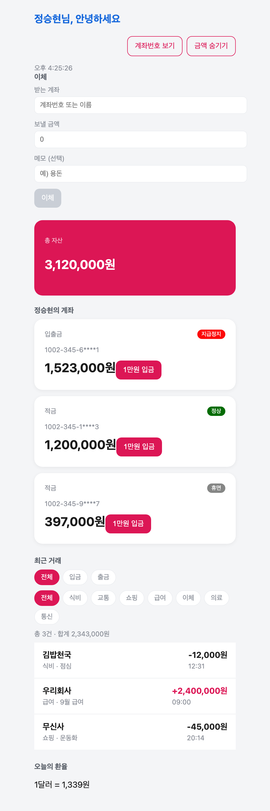
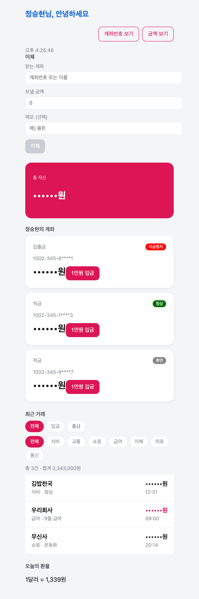

# 우리WON뱅킹 미니 (won-banking-mini)

## 1. 소개

React로 만든 **모바일 뱅킹 화면 미니 클론**입니다. 계좌 목록·잔액 조회, 1만원 입금, 계좌 이체, 거래내역 필터, 실시간 환율 조회를 담았습니다.

React를 처음 배우면서 컴포넌트 분리 · props · state · Context · 커스텀 훅을 하나씩 직접 적용해 본 학습 프로젝트입니다. 개인정보 보호를 고려해 **계좌번호 마스킹**과 **금액 숨기기**(지하철에서 앱을 켜는 상황) 기능을 넣었습니다.

- **배포 주소**: https://02-react.vercel.app/
- **저장소**: https://github.com/Seunghyun-Jeong/02_react

## 2. 화면

| 기본 화면 | 금액 숨기기 |
|---|---|
|  |  |

- 상단 툴바에서 **계좌번호 보기 / 금액 숨기기**를 토글합니다.
- 총 자산은 계좌 잔액의 합으로 **매 렌더마다 다시 계산**합니다. (별도 state 없음)
- 계좌 상태(정상 · 휴면 · 지급정지)에 따라 배지 색이 달라집니다.

## 3. 실행 방법

```bash
git clone https://github.com/Seunghyun-Jeong/02_react.git
cd 02_react

npm install       # 의존성 설치
npm run dev       # 개발 서버 (http://localhost:5173)
npm test          # 테스트 한 번 실행
npm run test:watch # 저장할 때마다 자동 실행
npm run build     # 배포용 빌드 → dist/
```

## 4. 폴더 구조

```
src/
├── App.jsx                    # 화면 전체 조립 + 계좌/거래 state 보관
├── main.jsx                   # 진입점. App을 #root에 렌더
├── index.css                  # 공통 스타일 (카드·버튼·툴바·폼)
├── App.css                    # App 전용 스타일
├── api/
│   └── exchange.js            # 환율 API 호출 (open.er-api.com)
├── components/
│   ├── AccountCard.jsx        # 계좌 카드 한 장 (마스킹·금액 가리기·입금 버튼)
│   ├── Clock.jsx              # 1초마다 갱신되는 시계
│   ├── ExchangeRate.jsx       # 환율 표시 (로딩·실패·성공 3분기)
│   ├── Header.jsx             # 사용자 인사말
│   ├── Panel.jsx              # 제목이 있는 섹션 껍데기
│   ├── StatusBadge.jsx        # 계좌 상태 배지 (색상 매핑)
│   ├── TransactionList.jsx    # 거래내역 + 종류/카테고리 필터
│   ├── TransactionRow.jsx     # 거래 한 줄
│   └── TransferForm.jsx       # 이체 폼 (입력 검증 포함)
├── contexts/
│   └── UserContext.jsx        # 사용자 정보를 props 없이 전달
├── data/
│   └── mockData.js            # 거래내역 더미 데이터
├── hooks/
│   └── useFetch.js            # 로딩·에러·재시도를 묶은 커스텀 훅
├── utils/
│   └── format.js              # 금액/계좌번호 포맷 순수 함수
└── setupTests.js              # 테스트 공통 설정
```

## 5. 사용한 React 개념

배운 개념이 **실제로 어느 파일에 쓰였는지** 정리했습니다.

### 컴포넌트 분리
화면을 역할 단위로 쪼갰습니다. `Panel.jsx`는 제목이 있는 섹션 껍데기이고, 안에 무엇이 들어갈지는 `children`으로 받습니다. `AccountCard.jsx`는 계좌 한 장, `TransactionRow.jsx`는 거래 한 줄만 책임집니다.

### props
`App.jsx` → `AccountCard.jsx`로 `accountNo`, `balance`, `showFullNo`, `hideAmount`, `onDeposit`을 내려보냅니다. **함수도 props로 전달**한다는 점이 핵심이었습니다. 카드는 "눌렸다"고 알리기만 하고, 실제 잔액 변경은 `App`이 합니다.

### state와 useState
- `App.jsx` — `accounts`, `transactions`, `showFullNo`, `hideAmount` 네 개를 보관합니다. 여러 컴포넌트가 함께 써야 하는 값이라 **공통 부모로 끌어올렸습니다(lifting state up)**.
- `TransferForm.jsx` — 입력값 3개를 `form` 객체 하나로 묶어 관리하고, `handleChange` 하나로 세 input을 모두 처리합니다.
- `TransactionList.jsx` — 필터 두 개(`typeFilter`, `categoryFilter`)는 이 컴포넌트만 쓰므로 **안쪽에 두었습니다.**

**state로 두지 않은 것**도 의도한 선택입니다. 총 자산(`App.jsx`의 `totalBalance`)은 `accounts`가 바뀌면 자동으로 다시 계산되므로 별도 state가 필요 없습니다.

### useEffect와 정리 함수
`Clock.jsx`에서 `setInterval`로 1초마다 시각을 갱신하고, **정리 함수에서 `clearInterval`**로 타이머를 끕니다. 이걸 빼먹으면 컴포넌트가 사라진 뒤에도 타이머가 살아남습니다.

`hooks/useFetch.js`에서는 `alive` 플래그로 **응답이 오기 전에 화면을 벗어난 경우**를 막습니다.

### useContext
`contexts/UserContext.jsx`에서 사용자 정보를 만들고, `Header.jsx` · `Panel.jsx` · `StatusBadge.jsx`가 **props를 거치지 않고** 직접 꺼내 씁니다. 특히 `StatusBadge`는 `App → Panel → AccountCard → StatusBadge`로 4단계를 내려가야 하는 값이라, props 전달(prop drilling)을 피하려고 Context를 썼습니다.

### 커스텀 훅
`hooks/useFetch.js`에 **로딩 · 에러 · 재시도** 세 가지 상태 관리를 묶었습니다. `ExchangeRate.jsx`는 이 훅 한 줄로 세 화면을 모두 처리합니다.

```jsx
const { data: rate, loading, error, reload } = useFetch(fetchUsdKrw)
```

### 조건부 렌더링과 리스트 렌더링
`accounts.map()` · `transactions.map()`으로 목록을 그리고, `key`에는 `accountId` / `txId` 같은 **고유값**을 씁니다. 순서가 바뀌어도 React가 항목을 헷갈리지 않도록 하기 위해서입니다.

## 6. 테스트

**Vitest + React Testing Library**로 작성했습니다. `npm test`로 실행합니다.

```
Test Files  3 passed (3)
     Tests  13 passed (13)
```

| 파일 | 무엇을 검사하나 |
|---|---|
| `utils/format.test.js` | 금액 포맷, 계좌번호 마스킹, 금액 가리기. 0원·음수·짧은 계좌번호 같은 **경계값**도 함께 검사 |
| `components/AccountCard.test.jsx` | 토글 상태에 따라 계좌번호와 금액이 실제로 **가려지는지 / 보이는지** |
| `App.test.jsx` | 입금 버튼을 누르면 총 자산이 늘고 거래내역이 추가되는지, 토글이 화면 전체에 반영되는지 |

테스트는 **리팩터링 안전망**으로 썼습니다. 죽은 코드를 지우고 변수 이름을 바꾸는 동안 "동작이 안 바뀌었다"를 매번 `npm test`로 확인했습니다.

컴포넌트 테스트에서는 `AccountCard`가 `useUser()`를 읽으므로 `UserProvider`로 감싸서 렌더합니다. **컴포넌트가 필요로 하는 환경까지 같이 만들어 줘야** 한다는 걸 배웠습니다.

## 7. 앞으로 할 것

### 화면 구조 개선

- **계좌 카드를 가로 스와이프로** — 지금은 계좌 3개가 세로로 쌓여 있어 아래로 스크롤해야 합니다. 실제 은행 앱처럼 카드를 옆으로 넘겨 보는 방식으로 바꾸고 싶습니다. CSS `scroll-snap-type: x mandatory`와 `scroll-snap-align`으로 카드 단위 스냅을 걸고, 현재 몇 번째 카드인지 알려주는 페이지 인디케이터(점)를 붙일 계획입니다. 스크롤 위치에서 "지금 보고 있는 카드"를 계산해 state로 올리면, **최근 거래도 그 계좌 것만** 보여줄 수 있습니다. 화면이 짧아지고 계좌와 거래내역이 자연스럽게 연결됩니다.

- **이체를 별도 탭으로 분리** — 지금은 홈 화면 하나에 이체 폼·계좌·거래내역·환율이 전부 올라가 있어 세로로 깁니다. 하단 탭바를 만들어 **홈 / 이체 / 거래내역**으로 나누려 합니다. `react-router-dom`을 붙여 URL로 화면을 구분하면 뒤로가기와 새로고침이 자연스럽게 동작하고, 각 화면이 자기 관심사만 갖게 되어 컴포넌트도 더 작아집니다.

### 안정성과 데이터

- **`formatWon(undefined)` 방어** — 지금은 데이터가 코드 안에 박혀 있어 안전하지만, 백엔드에 붙이면 잔액이 안 내려왔을 때 화면 전체가 하얗게 됩니다. 기본값 처리나 에러 경계(Error Boundary)가 필요합니다.
- **짧은 계좌번호 마스킹 보완** — `maskAccountNo('123')`이 `'****3'`이 되어 원본이 통째로 사라집니다. 길이 검사를 넣어야 합니다.

### 기능 추가

- **입금 금액 직접 입력** — 지금은 1만원 고정입니다.
- **거래내역 기간 필터** — 1개월 / 3개월 / 6개월 / 1년.
- **localStorage 연동** — 새로고침하면 입금·이체 기록이 사라집니다.
- **실제 API 연동** — 더미 데이터를 백엔드 REST API로 교체하고, `useFetch`를 그대로 재사용해 보고 싶습니다.
